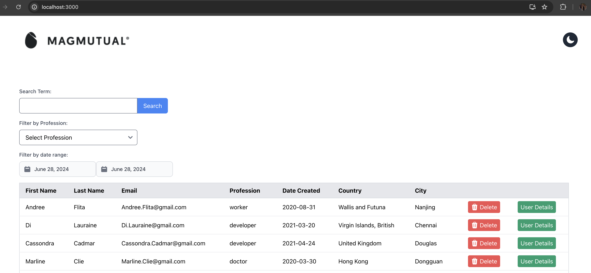
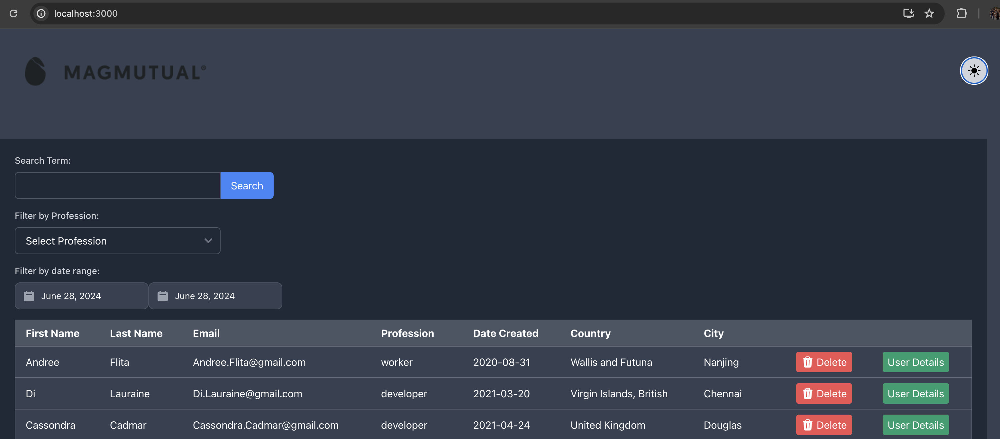
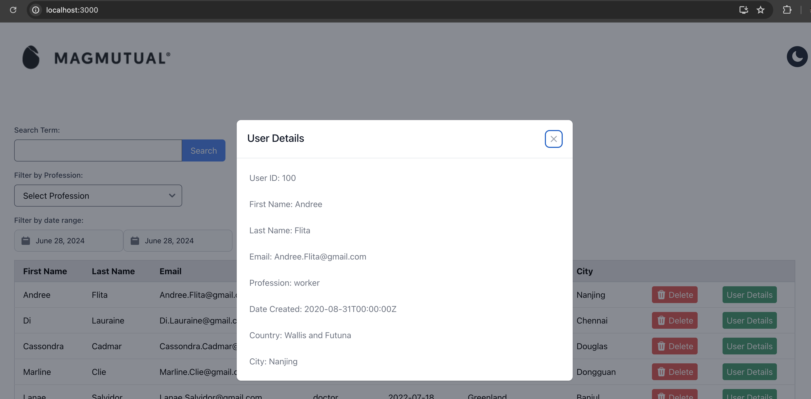
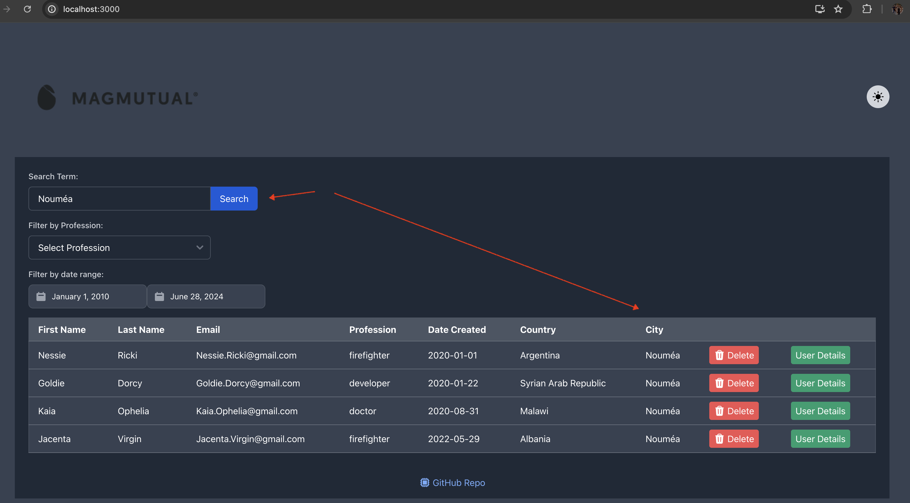
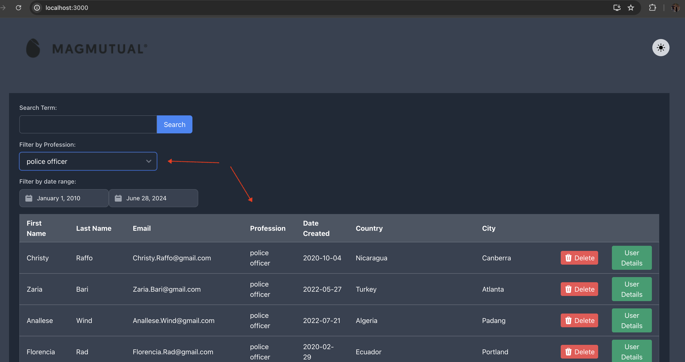
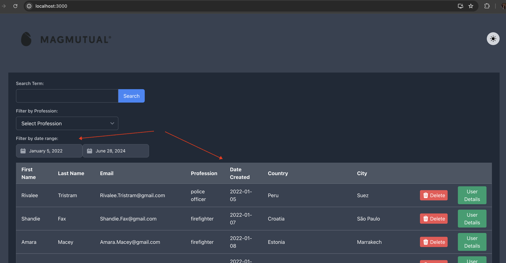

# User Management

User Management is a web application designed to manage users, perform searches, and handle some administrative tasks. This project leverages Go for the backend API and React for the frontend interface.

## Table of Contents

- [Getting Started](#getting-started)
    - [Prerequisites](#prerequisites)
    - [Installation](#installation)
- [Usage](#usage)
- [Answers to the questions from the assignment paper](#answers-to-the-following-questions)


## Getting Started

### Prerequisites

- [Docker](https://www.docker.com/get-started)
- [Docker Compose](https://docs.docker.com/compose/install/)

### Installation

1. Clone the repository:

    ```sh
    git clone https://github.com/alexrotar/user-management.git
    cd user-management
    ```

2. Copy the `.env.example` file to `.env` and configure your environment variables:

    ```sh
    cp .env.example .env
    ```

3. Build and start the application using Docker Compose:

    ```sh
    docker-compose up --build
    ```

This command will build the Docker images and start the containers for the backend API and the frontend application.


## User Database

In addition to simple ILIKE search functionality, I have implemented TSV (text search vector) which allows for more advanced search capabilities. 
TSV vectors takes into account plurals and different word forms, such as if you search "digits" it will find "digit" too or "innovating" will find "innovate", by using `english` dictionary. 
This make search more flexible and user-friendly.
For more sophisticated search solution I would recommend using [LLM Vector] with services like Pinecone, which is a vector search engine that allows you to search for similar items based on their embeddings.

## Usage

Once containers are up and running, you can access the application:

- Frontend: [http://localhost:3000](http://localhost:3000)
- Backend API: [http://localhost:8080](http://localhost:8080)

### Testing the Endpoints

You can use tools like `curl`, Postman, or a web browser to interact with the backend API. Below are some example requests:


1. **Get a list of first 10 users from the DB:**

    ```sh
    curl -X GET "http://localhost:8080/api/users"
    ```

2. **Delete a user by ID:**

    ```sh
    curl -X DELETE "http://localhost:8080/api/users/{id}"
    ```

3. **Endpoint to return a specific user (and all associated information):**

    ```sh
    curl -X GET "http://localhost:8080/api/users/{id}"
    ```

4. **Get list of available profession values for a dropdown options:**

    ```sh
    curl -X GET "http://localhost:8080/api/users/professions"
    ```

5. **Endpoint to return a list of users based on a specific profession:**

    ```sh
    curl -X GET "http://localhost:8080/api/users/professions/{professionName}"
    ```

6. **Search for users by (firstname, lastname, email, profession, country, city):**

    ```sh
    curl -X GET "http://localhost:8080/api/users/search?q=Chişinău"
    ```

7. **Endpoint to return a list of users created between a date range:**

    ```sh
    curl -X GET "http://localhost:8080/api/users/search/date-range?startDate=2020-01-01&endDate=2024-06-28"
    ```

## Answers to the following questions:

### **What did you think of the project?**

- The project provides a realistic and practical exercise that mirrors real-world scenarios in microservices development.
- It effectively tests essential skills such as API design, data handling, and front-end integration, which are crucial for a senior API engineer.
- The inclusion of a CSV file for user information is a good touch, as it simulates working with external data sources.

### **What didn’t you like about the project?**

- The requirements could be more detailed, especially regarding expected data structures and response formats, which would help ensure consistency.
- The scope might be a bit broad given the time constraint of one/two days, particularly when considering the need to build both the backend and a simple UI.

### **How would you change the project or approach?**

- Detailed Requirements: Provide more detailed specifications and example data to ensure clarity and consistency in expectations.
- Focus on Core Features: Given the time constraint, focus on building robust and well-documented backend endpoints first, and then a minimal UI to display the data.
- Testing and Documentation: Like unit testing and swagger documentation

### **Anything else you would like to share??**

- Project Management: Given the tight deadline, effective time management is crucial. Break down the project into smaller tasks and prioritize the most critical features.
- Scalability Considerations: Even though this is a small-scale project, design the microservice with scalability in mind to demonstrate best practices.
- Future Enhancements: Suggest potential enhancements for future iterations, such as advanced search features, user authentication, and more comprehensive error handling.
- Technology Stack: Leverage Go for the backend due to its performance and concurrency features, and React with Flowbite for the frontend to ensure a modern and responsive UI.


## Screenshots

### Light Mode


### Dark Mode


### Additional Screenshots



